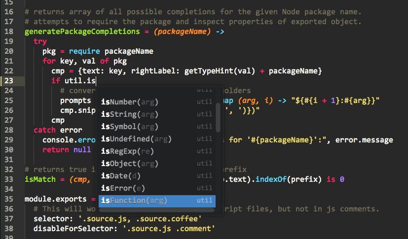

# Autocomplete Require [] (https://travis-ci.org/giladgray/autocomplete-require)

> An [Autocomplete+](https://atom.io/packages/autocomplete-plus) provider for require() statements. Almost like using an IDE...



#### The goal is to provide *nearly IDE-level autocomplete* for js/coffee development in [Atom](https://atom.io) by inspecting packages to *intelligently suggest* their contents.

This provider eagerly suggests completions based on contents of a package's export, including turning functions into snippets with arguments. It works really well with the built-in Node packages (`fs`, `http`, etc) and reasonably well with globally-installed Node modules.

I'm still working on fine-tuning the ability to load packages installed in your current project. If you're wondering why a package name didn't autocomplete, check the developer console for error messages.


## Usage

First, install [Autocomplete+](https://atom.io/packages/autocomplete-plus). Then, install this package.

```coffee
# First, require a package and assign it to a variable.
util = require 'util'

# Then "use" the variable to see all suggestions.
# Note the trailing . is important to indicate you're accessing its properties.
util.<whoa suggestions>

# Start typing a property name to filter (case-sensitive).
util.isF<filtered suggestions>

# Advanced: give the package a different name!
qs = require 'querystring'
qs.<nifty!>
```
